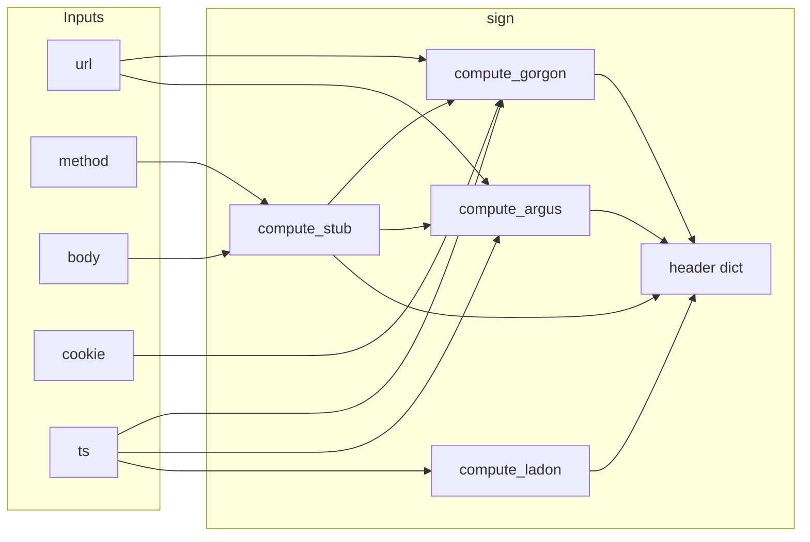

# TikTok Android Signing Toolkit (v44.x)

**Suggested public repository name:** `tiktok-android-signing-toolkit` — signing, device registration, login, tests. See [docs/GITHUB_SETUP.md](docs/GITHUB_SETUP.md) for description, topics, and release text.

[](https://www.python.org/downloads/)
[](LICENSE)
[](tests/test_all.py)

> **Badges:** After you create the repo, you can add live CI badges by replacing `YOUR_USER` / `YOUR_REPO` in [docs/GITHUB_SETUP.md](docs/GITHUB_SETUP.md) and pasting shields that point to your GitHub username and repository name.

**Languages:** **English (this file, default)** | [العربية / Arabic](README.ar.md)

A **research and reverse-engineering** Python toolkit derived from analysis of the official TikTok Android app and real MITM captures. It is meant to help you understand how API requests are built (signing headers, device registration, login flow) — **not** to abuse the service.

> **Warning:** Using these tools against TikTok servers or third-party accounts may violate Terms of Service and local laws. You are responsible for your use.

**Reference capture (example):** `Raw_03-17-2026-03-58-36.folder`  
**App:** `com.zhiliaoapp.musically` — aligned with v44.3.x builds (e.g. 440301 / 440315) · Android

---

## Table of contents 📑

1. [Requirements](#requirements)
2. [Installation](#installation)
3. [Project layout](#project-layout)
4. [Where to run commands](#where-to-run-commands)
5. [Quick start](#quick-start)
6. [Command-line tools (reference)](#command-line-tools-reference)
7. [Environment variables](#environment-variables)
8. [Python library usage](#python-library-usage)
9. [Login body password encoding](#login-body-password-encoding)
10. [Signing headers (overview)](#signing-headers-overview)
11. [Signing pipeline — `sign()`](#signing-pipeline) (includes [extended walkthrough](#signing-extended-walkthrough))
12. [Device identifiers](#device-identifiers)
13. [Login flow (simplified)](#login-flow-simplified)
14. [Common error codes](#common-error-codes)
15. [Tests](#tests)
16. [`tools/` directory](#tools-directory)
17. [`docs/` directory](#docs-directory)
18. [Sensitive files & `.gitignore`](#sensitive-files--gitignore)
19. [Related project: TikTokDeviceGenerator](#related-project-tiktokdevicegenerator)
20. [Technical references](#technical-references)
21. [Maintainer, company & contact](#maintainer-company--contact)
22. [Support this project](#support-this-project)

---

## Requirements 📋

- **Python 3.10+** (latest stable recommended)
- **`pycryptodome`** (for X-Argus — AES-CBC inside the engine)

---

## Installation ⚙️

```bash
cd tiktok_final
python3 -m venv .venv
source .venv/bin/activate   # Windows: .venv\Scripts\activate
pip install -r requirements.txt
```

Current `requirements.txt`:

```
pycryptodome>=3.20.0
```

Optional test paths may import extra packages; see `tests/test_all.py` if import errors appear.

---

## Project layout 🗂️

| Path | Purpose |
|------|---------|
| **`ttk/`** | Main Python package: signing, login, device registration, MITM helpers, etc. |
| **`ttk/paths.py`** | Defines `PROJECT_ROOT`, `FIXTURES_DIR`, `WORKSPACE_ROOT`, and **`resolve_data_path()`** (resolve relative paths against project root, then `fixtures/`). |
| **`fixtures/`** | Shared device JSON: `device_v44_3_1.json`, examples (`*.example.json`), `devices_001.json`, … |
| **`tests/`** | `test_all.py` — comprehensive test suite. |
| **`docs/`** | Login-flow docs, analysis notes, implementation plans. |
| **`tools/`** | Frida, JADX, Ghidra, APK/signature helpers, dump comparison. |
| **Repository root** | Thin launchers: **`login_client.py`**, **`device_register.py`**, **`flow.py`**, **`mitm_raw.py`**, **`feed_api_client.py`**, **`fake_login_probe.py`** — each delegates to `python3 -m ttk.<module>`. |

### `ttk/` modules (summary)

| Module | Role |
|--------|------|
| `signing_engine.py` | Local `X-Gorgon`, `X-Khronos`, `X-Argus`, `X-Ladon`, `X-SS-STUB`. |
| `login_client.py` | Full login client (multi-step; captcha/IDV where applicable). |
| `device_register.py` | Register a new device via TikTok `device_register` API. |
| `flow.py` | Register device, then login in one flow. |
| `mitm_raw.py` | Parse Raw MITM folders; diff / export device fingerprint. |
| `fake_login_probe.py` | Dry probe (no real password) to validate headers / server response. |
| `feed_api_client.py` | Example signed feed request. |
| `device_guard.py` | Ticket guard material when keys are present. |
| `virtual_devices.py` | Dynamic virtual device profiles; optional JSON store under `fixtures/virtual_devices.json`. |
| `rapidapi_signer.py` | Remote signing via RapidAPI (alternative to local engine). |
| `tiktok_apk_sig.py` | Extract / merge `sig_hash` from APK into a device template. |

---

## Where to run commands 📍

Run **everything from the `tiktok_final/` directory** (the folder that contains the `ttk/` package) so `import ttk` works.

Either:

- **`python3 login_client.py ...`** (root shim), or  
- **`python3 -m ttk.login_client ...`** (module form).

---

## Quick start 🚀

### A) Login with the default fixture device

```bash
python3 login_client.py --username USER --password "YourPassword"
```

Default profile: **`fixtures/device_v44_3_1.json`** unless you pass `--device`.

### B) Username check only (step 1)

```bash
python3 login_client.py --username USER --step1
```

### C) Register a new device, then login

```bash
python3 device_register.py --out my_device.json --verbose
python3 login_client.py --device my_device.json --username USER --password "PASS"
```

For a **desktop GUI** that registers devices in **batch** using **Java + [unidbg](https://github.com/zhkl0228/unidbg)** (binary payload → `device_register`), see the related repo **[TikTokDeviceGenerator](https://github.com/code-root/TikTokDeviceGenerator)** — useful alongside this toolkit’s pure-Python `device_register` and JSON fixtures.

### D) Full flow: register + login

```bash
python3 flow.py --username USER --password "PASS"
```

### E) Sign a request manually (local engine)

```bash
python3 -m ttk.signing_engine --url 'https://...?' --method POST --body 'a=b' --cookie '...'
```

---

## Command-line tools (reference) 🖥️

### 1) `login_client`

| Flag | Description |
|------|-------------|
| `--username` | Required. TikTok username. |
| `--password` | Plain password (encoded automatically). |
| `--password-hex` | Pre-encoded hex password. |
| `--device` | Path to device JSON (default: fixture profile). |
| `--proxy` | HTTP(S) proxy URL. |
| `--proxy-file` | First valid `host:port:user:pass` line → proxy. |
| `--no-proxy` | Ignore proxy files and proxy-related env vars. |
| `--step1` | Run check-login-name only. |
| `--step2` | Run `pre_check` only. |
| `--skip-check` | Skip step 1. |
| `--region-email` | Email for `/passport/app/region/` `hashed_id` where applicable. |
| `--devices-batch` | JSON like `devices_001.json` (`.devices[].record`) merged into `--device` base. |
| `--batch-offset` / `--batch-limit` | Slice the batch. |
| `--proxy-rotate-file` | Per-row rotating proxy file with batch mode. |
| `--batch-summary-out` | Write JSON summary after batch. |
| `--verbose` | Verbose HTTP dump. |
| `--sign-backend local\|rapidapi` | Local signing (default) or RapidAPI. |
| `--rapidapi-key` | RapidAPI key (or `RAPIDAPI_KEY`). |

**Batch example:**

```bash
python3 login_client.py --username U --step1 --devices-batch fixtures/devices_001.json
```

---

### 2) `device_register`

| Flag | Description |
|------|-------------|
| `--base` | Base hardware profile (resolved via `resolve_data_path`, default fixture). |
| `--apk` | APK path — extract `sig_hash` and merge before the request. |
| `--extract-sig-only` | With `--apk` + `--out`: patch JSON only; no server registration. |
| `--virtual REGION` | Build base from `virtual_devices.generate_device_profile` (overrides `--base`). |
| `--out` | Output JSON (default `device_<timestamp>.json` in project root). |
| `--proxy` / `--proxy-file` | Proxy. |
| `--verbose` | Verbose. |
| `--allow-local-fallback` | On server zero/failure: still write random local IDs (**not** server-registered). |
| `--dump-golden DIR` | Save per-attempt request/response JSON (MITM diff). |
| `--golden-only DIR` | Single golden snapshot and exit. |

---

### 3) `flow`

| Flag | Description |
|------|-------------|
| `--username` / `--password` / `--password-hex` | Credentials. |
| `--device` | Use existing device JSON (skip registration). |
| `--skip-register` | Use default fixture without registering. |
| `--save-device` | Where to save the device after successful registration. |
| `--proxy` / `--proxy-file` | Proxy for register + login. |
| `--verbose` | Verbose. |
| `--region-email` | Same as `login_client`. |
| `--allow-local-fallback` | Same as `device_register`. |

After registration, the flow may call **`get_domains/v5/`** to warm up session cookies (see `flow.py`).

---

### 4) `mitm_raw`

Positional argument: path to a **`Raw_MM-DD-YYYY....folder`** directory.

| Flag | Description |
|------|-------------|
| `--list` | List passport/login-related request files. |
| `--dump FILE` | Parse one request file → JSON on stdout. |
| `--suggest FILE` | Suggest device JSON patch from one request. |
| `--flow-diff` | Compare request order vs `login_client` reference. |
| `--export-device OUT.json` | Merge MITM fingerprint into a template JSON. |
| `--template BASE.json` | Device template (e.g. `fixtures/device_v44_3_1.json`). |
| `--from-file FILE` | Specific Raw `.txt` instead of auto-discovery. |

---

### 5) `fake_login_probe`

| Flag | Description |
|------|-------------|
| `--device` | Device JSON (default may point to a root-level file if present). |
| `--username` | Fixed username; otherwise random `probe_*`. |
| `--proxy` / `--proxy-file` / `--no-proxy` | Proxy controls. |
| `--mitm-folder` / `--mitm-only` / `--mitm-list-repo` | Discover Raw folders near the repo. |
| `--verbose` | Verbose. |
| `--skip-region` | Skip nonce / region chain. |
| `--only-sign` | Print local signatures only (offline). |
| `--step1-only` | Stop after first check step. |

---

### 6) `feed_api_client`

Example script that fetches the feed when a registered device file exists (by default looks for **`device_emulator_registered.json`** in the **project root**). See the module for required profile fields.

---

### 7) `signing_engine` (CLI)

| Flag | Description |
|------|-------------|
| `--url` | Full URL including query string. |
| `--method` | HTTP method (default `POST`). |
| `--body` | Request body string. |
| `--cookie` | `Cookie` header value. |
| `--ts` | Unix timestamp (default: now). |

---

## Environment variables 🔧

| Variable | Use |
|----------|-----|
| `RAPIDAPI_KEY` / `X_RAPIDAPI_KEY` | RapidAPI key when using `--sign-backend rapidapi`. |
| `TIKTOK_SIGN_BACKEND` | `local` or `rapidapi`. |
| `TIKTOK_PROXY_FILE` | Path to a proxy list file (`host:port:user:pass` per line). |
| `TIKTOK_PROXY` / `HTTP_PROXY` / `HTTPS_PROXY` | Proxies for TikTok HTTP calls (see `login_client`). |
| `TIKTOK_MITM_FOLDER` | Default MITM folder for some `fake_login_probe` discovery paths. |

---

## Python library usage 🐍

```python
from ttk.signing_engine import sign, compute_stub

sig = sign(
    url="https://api16-normal-c-alisg.tiktokv.com/passport/user/login/?aid=1233&ts=1234567890",
    method="POST",
    body=b"username=test&password=test",
    cookie="store-idc=useast5; ...",
)
# sig → X-Gorgon, X-Khronos, X-Argus, X-Ladon, X-SS-STUB (as applicable)
```

```python
from ttk.login_client import TikTokLoginClient, encode_password
from ttk.paths import FIXTURES_DIR, PROJECT_ROOT, resolve_data_path

client = TikTokLoginClient(device_path=None, verbose=True)
# encode_password("secret")  # default XOR 0x05 (newer builds)
```

```python
from ttk.device_register import TikTokDeviceRegister

dr = TikTokDeviceRegister(verbose=True)
reg = dr.register()
```

```python
from ttk.rapidapi_signer import sign_via_rapidapi  # needs RAPIDAPI_KEY in environment
```

---

## Login body password encoding 🔑

Usernames/passwords in `x-www-form-urlencoded` bodies are XOR’d per code unit, then written as hex pairs.

- **Newer builds (aligned with v44.3.15 in this repo):** XOR key **`0x05`** (`LOGIN_BODY_XOR_KEY` in `login_client`).
- **Older notes (44.3.1-style):** you may need **`xor_key=0x17`**:

```python
from ttk.login_client import encode_password

encode_password("MyPassword123")                # default 0x05
encode_password("MyPassword123", xor_key=0x17)  # older style
```

---

## Signing headers (overview) 🔐

| Header | Idea | Main inputs |
|--------|------|-------------|
| `X-SS-STUB` | `MD5(body).upper()` | Raw body bytes |
| `X-Khronos` | Unix time | `ts` |
| `X-Gorgon` | RC4-like + nibble/bit mixing | Query string, STUB, cookie, `ts` |
| `X-Ladon` | SIMON-128 / PKCS7 | `{ts}-{license_id}-{aid}` |
| `X-Argus` | Protobuf + layered crypto | Query/device fields + `ts` |

Constants and math live in **`ttk/signing_engine.py`**; narrative docs are under **`docs/`**.

---

<a id="signing-pipeline"></a>

## Signing pipeline — `sign()` ✍️

All **local** signing goes through **`ttk.signing_engine.sign()`**. Any change to the **URL query**, **raw body bytes**, **`Cookie` string**, or **`ts`** changes the headers.

### Inputs

| Argument | Role |
|----------|------|
| `url` | **Full** URL including **`?query=...`**. Only the part after `?` is used for signing. |
| `method` | `"GET"` / `"POST"` / … — affects **`X-SS-STUB`**. |
| `body` | **`bytes` or `str`** (UTF-8 if str). Must match **exactly** what is hashed for STUB on the wire (see gzip note below). |
| `cookie` | Full **`Cookie`** header string as sent on the wire. |
| `ts` | Unix `int`; default `int(time.time())`. Used by Gorgon, Ladon, Argus. |

### Order of operations inside `sign()` (summary)

1. Resolve **`ts`** (now if omitted).
2. **`query_string`** ← `urlparse(url).query`.
3. **`body_bytes`** ← normalized body.
4. **`X-SS-STUB`** ← if body is non-empty **and** method is not `GET`: `MD5(body_bytes).hexdigest().upper()`; otherwise omit from the result dict.
5. **`compute_gorgon(query_string, stub, cookie, ts)`** → **`X-Gorgon`**, **`X-Khronos`** (stringified `ts`).
6. **`compute_argus(query_string, stub, ts)`** — needs **pycryptodome**; returns `""` if missing.
7. **`compute_ladon(ts)`** → **`X-Ladon`** (embeds 4 random bytes unless you override at API level).
8. Merge final dict: `X-Khronos`, `X-Gorgon`, `X-Ladon`, `X-Argus`, plus `X-SS-STUB` when present.



### How `X-Gorgon` is built (high level)

1. First **4 bytes** from **`MD5(query_string)`** (UTF-8).
2. Next **4 bytes** from the 32-char hex **`X-SS-STUB`**, or zeros if no STUB.
3. Next **4 bytes** from **`MD5(cookie)`**, or zeros if empty.
4. **4 zero bytes**, then **4 bytes** from the 8-hex-digit encoding of **`ts`** → **20 bytes** total.
5. Run an **RC4-like KSA + PRGA**, then **`_gorgon_handle`** (nibble swap, bit reverse, XOR).
6. Prefix with version **`8404`** (and per-version constants) + **40 hex chars** from the 20-byte state → commonly **52 characters** for `8404…`.

> Byte-perfect parity with the shipping app may still depend on binary-internal constants; this engine matches the **documented dependency chain** (query / stub / cookie / `ts`).

### How `X-Ladon` is built

1. Plaintext: **`"{ts}-{license_id}-{aid}"`** (defaults inside `compute_ladon`).
2. **`rand`** = 4 random bytes.
3. Key schedule from **`MD5(rand + str(aid))`**, then **SIMON-128**-style block encryption with **PKCS7** on the plaintext.
4. Output: **`base64(rand ‖ ciphertext)`**.

### How `X-Argus` is built

1. Parse **query** into fields (`device_id`, `version_name`, `channel`, `os_version`, …).
2. **`body_hash`** = first 6 bytes of **SM3** over raw STUB bytes (16 bytes from hex STUB); **`query_hash`** from SM3 over the query string.
3. Pack a **custom protobuf-like structure** (field numbers as in code), including **`channel` matching the query**.
4. Encode → PKCS7 → **SIMON** encrypt → **XOR + reverse** layer → fixed prefixes.
5. **AES-CBC** with key/IV derived via **MD5** from **`_ARGUS_SIGN_KEY`** slices.
6. **Base64** output with the `\xf2\x81` + ciphertext framing used by the app.

### `X-SS-STUB` and gzip bodies

- Default **`sign()`**: STUB = **MD5 of the body bytes you pass** (typically uncompressed JSON/form).
- **`device_register`** can send **gzip** on the wire; the **`java_gzip_sig`** path documents STUB as **MD5 of gzip bytes**. When emulating that, pass the **same byte sequence** into `sign()` that the app hashes.

### Alternative: RapidAPI signing

With **`--sign-backend rapidapi`**, **`X-Gorgon` / `X-Ladon` / `X-Argus` / `X-Khronos`** come from a remote API; **`X-SS-STUB`** is still computed locally (`compute_stub`) when a body exists. See **`ttk/rapidapi_signer.py`** and **`RAPIDAPI_KEY`**.

### Code pointers

- Unified API: **`sign()`** — roughly lines 559–603 in **`ttk/signing_engine.py`**.
- Granular helpers: **`compute_stub`**, **`compute_gorgon`**, **`compute_ladon`**, **`compute_argus`**.

---

<a id="signing-extended-walkthrough"></a>

### Extended technical walkthrough (step-by-step)

The following mirrors **`ttk/signing_engine.py`**: **stdlib** only, plus **`pycryptodome`** for **AES-CBC** inside Argus.

#### Cryptographic primitives in this module

| Primitive | Role |
|-----------|------|
| **MD5** | Query/cookie strings (UTF-8); STUB preimage bytes; Argus AES key/IV material (`MD5` of 16-byte slices of `_ARGUS_SIGN_KEY`). |
| **SM3** (GB/T 32905-2016) | Pure-Python `_SM3`; Argus `body_hash` / `query_hash` (first 6 bytes each); fixed `_ARGUS_SM3_OUTPUT` seeds Argus SIMON keys. |
| **SIMON-128/128** | 72-round block cipher (`simon_enc`); Argus encrypts each 16-byte protobuf block; Ladon uses a custom multi-round Feistel schedule per block. |
| **AES-128-CBC** | Final Argus envelope (`Crypto.Cipher.AES`). |
| **Protobuf (minimal)** | `_ProtoBuf`: `int` → varint, `str`/`bytes` → length-delimited, nested `dict` → sub-message. |
| **PKCS#7** | Pad to multiple of 16 before SIMON/AES. |

#### `X-SS-STUB` — numbered steps

1. In **`sign()`**, if **`method.upper() == "GET"`** or **body is empty** → **omit** `X-SS-STUB` from the returned dict.
2. Normalize **`body`**: `str` → **`utf-8`**; keep `bytes` unchanged.
3. **`stub_lower = MD5(body_bytes).hexdigest()`** (32 lowercase hex chars from hashlib).
4. Exposed header: **`X-SS-STUB = stub_lower.upper()`** (32 **uppercase** hex characters).
5. **Downstream use:** **`compute_gorgon`** takes that **uppercase** string and reads the **first 8 hex pairs** as bytes **4–7** of the 20-byte Gorgon state. **`compute_argus`** converts the stub string with **`bytes.fromhex(stub)`** when non-empty; if Argus is called with **no** stub, it uses **16 zero bytes** for SM3 input (`stub_bytes`).

#### `X-Khronos`

- **`X-Khronos`** is **`str(ts)`** — the same integer Unix timestamp embedded in bytes **16–19** of the Gorgon state.
- Always keep **`X-Khronos`** consistent with the **`ts`** passed into **`sign(..., ts=)`** when reproducing a capture.

#### `X-Gorgon` — numbered steps

1. Choose **Gorgon version** string (default **`8404`**). Load **8 key bytes** from **`_GORGON_HEX_STR[version]`** (`8404` → all zeros; **`0404`** uses legacy non-zero constants).
2. Format **`ts`** as **`hex(ts)[2:].zfill(8)`** — exactly **8** hex digits (pad with leading zeros).
3. **`url_md5 = MD5(query_string.encode("utf-8")).hexdigest()`** — take the **first 8 hex characters** → **4 bytes** → indices **0–3** of working state.
4. **Bytes 4–7:** from **`X-SS-STUB`** (first 8 hex digits of the **32-char uppercase** stub) or **zeros** if no stub.
5. **Bytes 8–11:** first 4 bytes of **`MD5(cookie.encode("utf-8"))`** if cookie non-empty, else **zeros**.
6. **Bytes 12–15:** **fixed zeros**.
7. **Bytes 16–19:** the **four bytes** implied by the **8 hex digits** of **`khronos_hex`** (two hex chars per byte).
8. Run **`_gorgon_ksa(hex_str)`** → 256-byte table (RC4-like **KSA**; uses `hex_str[i % 8]` and a special case when a partial sum equals **85**).
9. Run **`_gorgon_prga(inp, table)`** — 20 iterations, each XORs `inp[i]` with a byte derived from the evolving table (stream-like).
10. Run **`_gorgon_handle(inp)`** on the 20 bytes: per index **i**: nibble-swap current byte; XOR with **next** byte (wrap at 20); **reverse bits** of that; XOR **20**; bitwise **`~`**; mask **`0xFF`**.
11. **`sig`** = concatenation of the **20** resulting bytes as **two lowercase hex digits each** → **40** hex chars.
12. **Final header** = **`version`** + **four** hex octets taken from fixed indices of **`hex_str`** (`hex_str[7]`, `[3]`, `[1]`, `[6]` formatted as `02x`) + **`sig`**. For **`8404`** with zero key table, the middle four octets are often **`00000000`**, giving a **52-character** string pattern **`840400000000` + 40**.

#### `X-Ladon` — numbered steps

1. Resolve **`ts`** (default now), **`license_id`** (default **1611921764**), **`aid`** (default **1233**).
2. Build UTF-8 plaintext **`b"{ts}-{license_id}-{aid}"`**.
3. Draw **`rand = os.urandom(4)`** unless the caller passes **`rand=`** into **`compute_ladon`** (the public **`sign()`** does not expose this — each call is random).
4. **`keygen_bytes = rand + str(aid).encode("ascii")`**.
5. **`md5hex_bytes = MD5(keygen_bytes).hexdigest().encode("ascii")`** (32-byte ASCII hex).
6. PKCS7-pad the plaintext to a multiple of **16** bytes.
7. **`_ladon_keyschedule`** expands **`md5hex_bytes`** into a **272+** byte table of 64-bit subkeys (outer loop **`0x22`** times).
8. For each **16-byte block**, apply **34** (`0x22`) Feistel rounds using subkeys from the schedule (see **`_ladon_encrypt_data`** — two 64-bit halves per block, little-endian).
9. Output = **`rand (4 bytes) ‖ ciphertext`**, then **`base64`** → **`X-Ladon`**.

#### `X-Argus` — numbered steps

**If `pycryptodome` is missing → return empty string.**

1. **`parse_qs(query_string)`** — use **first** value for each key (`_qp`).
2. **`channel = query["channel"]` or `"googleplay"`** — must match the real app channel in the URL when comparing to traffic.
3. **`stub_bytes`**: **`bytes.fromhex(stub)`** if stub provided, else **16 zero bytes**.
4. **`body_hash = SM3(stub_bytes)[:6]`** (6 bytes).
5. **`query_hash = SM3(query_string.encode("utf-8") if query_string else bytes(16))[:6]`**.
6. Fill protobuf **`bean`** with fields **1,2,3,4,5,6,7,8,9,10,11,12,13,14,20,23** (and optional **16** `sec_device_id`) exactly as in source — notably **12:** `ts << 1`, **13/14:** 6-byte hashes, **23:** nested map with **device_type**, **os_version**, **channel**, **`_argus_calculate_constant(os_version)`** (weighted sum of up to 6 digits from a normalized `os_version` string).
7. **`pb_raw = _ProtoBuf(bean).to_bytes()`**.
8. **`pb_padded = aes_pad(pb_raw, 16)`** (PKCS7).
9. **SIMON-128** encrypt every 16-byte block: key words from **`_ARGUS_SM3_OUTPUT[:32]`** unpacked as four **uint64** little-endian values (`_argus_simon_key_list`).
10. **`_argus_xor_reverse(enc_pb)`**: prepend **`f2 f7 fc ff f2 f7 fc ff`**, XOR positions **8..end** with repeating 8-byte XOR key from the prefix, **reverse** all bytes.
11. Wrap with prefix **`a6 6e ad 9f 77 01 d0 0c 18`** and suffix ASCII **`ao`**.
12. PKCS7-pad again to 16-byte boundary.
13. **AES-CBC**: **`key = MD5(_ARGUS_SIGN_KEY[0:16]).digest()`**, **`IV = MD5(_ARGUS_SIGN_KEY[16:32]).digest()`**, encrypt.
14. Return **`Base64( b"\xf2\x81" + ciphertext )`** as a UTF-8 string.

#### Coupling matrix (what shares what)

| Header | Uses `query` | Uses `body`/STUB | Uses `cookie` | Uses `ts` | Uses randomness |
|--------|----------------|------------------|----------------|-----------|-----------------|
| `X-SS-STUB` | — | yes | — | — | — |
| `X-Khronos` | — | — | — | yes | — |
| `X-Gorgon` | yes | yes (via STUB) | yes | yes | — |
| `X-Ladon` | — | — | — | yes | **yes** (4 bytes) |
| `X-Argus` | yes | yes (via SM3 of stub bytes) | — | yes | **yes** (field 3) |

#### Practical checklist when matching captures

1. Copy the **exact** query string (including **`channel`**, **`version_name`**, **`device_id`**, …).
2. Use the **exact** `Cookie` header value for Gorgon (full string).
3. Hash the **same body bytes** the app hashed (watch **gzip vs plain** for STUB).
4. Fix **`ts`** to the capture’s Khronos if you need identical Gorgon/Argus/Ladon timing.
5. Align **Argus** defaults (`sdk_version`, `sdk_version_int`, `license_id`, `aid`) with the device JSON / capture.
6. Expect **Ladon** to differ run-to-run unless you patch **`compute_ladon(..., rand=...)`** for experiments.

#### Local verification

- **`python3 -m ttk.signing_engine --url '...' --body '...' --cookie '...' --ts CAPTURE_TS`**
- **`python3 tests/test_all.py`** — STUB/Khronos exact checks; Gorgon/Argus format checks against captured shapes.

#### Argus protobuf **field 23** — nested message (byte-level picture)

In **`compute_argus`**, **`bean[23]`** is a **nested dict**. The minimal encoder **`_ProtoBuf`** in **`signing_engine.py`** serializes any **`dict` value** as a **length-delimited sub-message** (same as protobuf **wire type 2** / `STRING` in this encoder): the **parent** gets **field number 23**, and its **payload** is **`_ProtoBuf(inner).to_bytes()`**.

Inner map (logical):

| Inner field # | Python value source | Encoder wire type in `_ProtoBuf` |
|---------------|---------------------|-------------------------------------|
| **1** | `_qp("device_type")` | **string** → tag `(1<<3)|2`, varint length, UTF-8 bytes |
| **2** | `_qp("os_version")` | **string** → tag `(2<<3)|2`, varint length, UTF-8 bytes |
| **3** | `channel` (from query or `"googleplay"`) | **string** → tag `(3<<3)|2`, varint length, UTF-8 bytes |
| **4** | `_argus_calculate_constant(os_version)` **int** | **varint** → tag `(4<<3)|0`, varint body |

Conceptual nesting (not actual hex dump — lengths depend on strings):

```text
[root message fields 1,2,3,…,22,23,…]
        │
        └── field 23 (len-delimited) ──► nested bytes:
                ├── field 1  (len-delim) "device_type"   e.g. sdk_gphone64_arm64
                ├── field 2  (len-delim) "os_version"    e.g. "16"
                ├── field 3  (len-delim) "channel"       e.g. samsung_store
                └── field 4  (varint)    f(os_version)   e.g. 32768 for "16" with default weights
```

**`_argus_calculate_constant`:** takes **`os_version`** string, keeps digits only, **zero-pads to 6 digits**, maps each digit to **`[20480, 2048, 20971520, 2097152, 1342177280, 134217728]`** and sums — used only inside field **23.4**.

**Empty query string:** `query_hash = SM3(bytes(16))[:6]` (hash of **16 zero bytes**), **not** an empty SM3 input. Example first **6 bytes** of that digest (hex): **`106E34A2B8C7`**.

#### Reference hex from `tests/test_all.py` (captures **CAP_2913**, **CAP_2820**)

Constants live at the top of **`tests/test_all.py`**. Use them to reproduce **STUB**, **Khronos**, and **SM3 slices** for Argus.

**`CAP_2913`** — POST `/passport/user/login/` (capture **[2913]**)

| Item | Value (excerpt or full) |
|------|-------------------------|
| **`X-SS-STUB`** | `2334A127910BFD04C800293D423DEFA7` |
| **`X-Khronos`** (with `ts=1773712689`) | `1773712689` |
| **`ts` passed to `sign()`** | `1773712689` |
| **Captured `X-Gorgon` (reference only)** | `8404c01c000098c0cd010cdc36e96ebb4a7782bd8189fcda33c8` — tests note exact match is **not** expected with the open engine (key material in app binary); format **52** chars, prefix **`8404`**, lowercase hex in output. |
| **First 6 bytes of `SM3(stub_bytes)`** (`stub_bytes` = 16 bytes from STUB hex) | **`0AD0A7F0A1F7`** |
| **First 6 bytes of `SM3(query_utf8)`** for CAP_2913 query string | **`414D4CED13BA`** |

**`CAP_2820`** — POST `pre_check` body (capture **[2820]**)

| Item | Value |
|------|--------|
| **Body (prefix)** | `account_sdk_source=app&multi_login=1&mix_mode=1&username=76716a7760627637` |
| **`X-SS-STUB`** | `AFAB3892DC07AA8D95D49D68B9FF63CA` |

**`CAP_2817`** — GET `check_login_name_registered`: **no** body → **no** `X-SS-STUB` in `sign()` output; Gorgon uses **zero** stub slot.

**Example — reproduce STUB + Khronos in Python**

```python
from ttk.signing_engine import sign, compute_stub
from tests.test_all import CAP_2913

assert compute_stub(CAP_2913["body"].encode()) == CAP_2913["X-SS-STUB"]
sig = sign(
    url=CAP_2913["url"],
    method="POST",
    body=CAP_2913["body"],
    cookie=CAP_2913["cookie"],
    ts=CAP_2913["ts"],
)
assert sig["X-Khronos"] == CAP_2913["X-Khronos"]
assert sig["X-SS-STUB"] == CAP_2913["X-SS-STUB"]
```

---

## Device identifiers 📱

| Field | Shape | Typical generation in this repo |
|-------|-------|----------------------------------|
| `device_id` | ~19 decimal digits | CSPRNG at registration |
| `iid` (install_id) | similar | CSPRNG |
| `openudid` | 16 hex chars | random |
| `cdid` | UUID string | random |

See JADX references in comments inside **`device_register.py`**.

---

## Login flow (simplified) 🚪

```
Client                              TikTok servers
  │                                       │
  │──[1] GET check_login_name ───────────▶ aggr16-normal.tiktokv.us
  │◀──────── is_registered / … ──────────│
  │                                       │
  │──[2] POST login/pre_check ───────────▶ api16-normal-c-alisg.tiktokv.com
  │◀──────── error_code: 0 … ────────────│
  │                                       │
  │──[3] POST login ─────────────────────▶ api16-normal-c-alisg.tiktokv.com
  │◀──────── session_key, uid, … ────────│
```

The **full** app flow is longer (region, captcha, IDV, …). See **[docs/LOGIN_FLOW.md](docs/LOGIN_FLOW.md)** and **[docs/LOGIN_FLOW_V44_3_15.md](docs/LOGIN_FLOW_V44_3_15.md)**.

---

## Common error codes ⚠️

| `error_code` | Meaning | What to try |
|--------------|---------|-------------|
| `0` | Success | — |
| `7` | Rate limit | Different device / proxy / timing |
| `1105` | Captcha | Solve or follow app-equivalent flow |
| `2046` | Wrong password | Check encoding / account |
| `2048` | Account not found | Check username |

---

## Tests 🧪

From `tiktok_final/`:

```bash
python3 tests/test_all.py
```

Covers signing, login helpers, device registration, JSON schema, and more. If **`login_sessions.json`** exists in the project root, extra session tests run; otherwise they are skipped (friendly for public clones).

---

## `tools/` directory 🛠️

| Tool | Role |
|------|------|
| `frida_controller.py` + `frida_hook_tiktok.js` | On-device hooking / capture via Frida. |
| `jadx_analyzer.py` | Scan JADX output; diff constants vs `ttk/signing_engine.py`. |
| `ghidra_analyze.py` | Binary analysis (requires Ghidra / pyghidra setup). |
| `apk_sig_hash.py` | APK signature hashing. |
| `android_sig_bruteforce.py` / `prepare_bruteforce.py` | Signature search / prep utilities. |
| `compare_device_register_dump.py` | Compare golden / dump JSON files. |

Run most scripts from **`tools/`** or pass absolute paths as documented in each file’s docstring.

---

## `docs/` directory 📚

| File | Contents |
|------|----------|
| [LOGIN_FLOW.md](docs/LOGIN_FLOW.md) | Login flow parameters and detail. |
| [LOGIN_FLOW_V44_3_15.md](docs/LOGIN_FLOW_V44_3_15.md) | v44.3.15 + MITM notes. |
| [ANALYSIS_REPORT.md](docs/ANALYSIS_REPORT.md) | Analysis write-up. |
| [implementation_plan.md](docs/implementation_plan.md) | Historical implementation plan. |
| [plan_tiktok_signer.md](docs/plan_tiktok_signer.md) | Historical signer plan. |

---

## Sensitive files & `.gitignore` 🔒

Do **not** commit real sessions, live proxies, private keys, or full MITM exports. Examples: `login_sessions.json`, `proxsy.txt`, `golden_out/` (per repo policy), local MITM device JSON, etc.

See **`.gitignore`** for the current list.

---

<a id="related-project-tiktokdevicegenerator"></a>

## Related project: TikTokDeviceGenerator 🔗

**[github.com/code-root/TikTokDeviceGenerator](https://github.com/code-root/TikTokDeviceGenerator)** — companion tooling focused on **creating / registering many devices**:

| | |
|--|--|
| **What it is** | Desktop **Tkinter** app; builds registration payloads via **Java** and **unidbg** (native emulation), **POST**s to TikTok’s **`device_register`** endpoint (`log-va.tiktokv.com/service/2/device_register/`), saves **`device_id` / install_id (IID)** and metadata as **JSON**. |
| **Strengths** | **Batch** mode with **threading**, optional **HTTP/SOCKS** proxy, chunked output under `Device/` and batch summaries under `generated_devices/`. |
| **Docs** | Bilingual **[README.md](https://github.com/code-root/TikTokDeviceGenerator/blob/main/README.md)** (English) and **[README.ar.md](https://github.com/code-root/TikTokDeviceGenerator/blob/main/README.ar.md)** (Arabic). |
| **License** | MIT (see upstream repo). |

This **tiktok_final** repo stays centered on **Python signing (`ttk/signing_engine`)**, **`login_client`**, and **documented** `device_register` flows. **TikTokDeviceGenerator** is a practical option when you want a **GUI + unidbg** path for bulk device creation; combine its JSON output with **`login_client --device …`** here if the profile shape is compatible (validate fields before production use).

> Use any third-party tool only in compliance with applicable laws and TikTok’s Terms of Service.

---

## Technical references 📖

- [Hex-Rays FLIRT user guide](https://docs.hex-rays.com/user-guide/signatures/flirt) — library identification in IDA / similar workflows.

---

<a id="maintainer-company--contact"></a>

## Maintainer, company & contact 👤

| | |
|---|---|
| **Developer** | Mostafa Al-Bagouri |
| **Company** | **[Storage TE](http://storage-te.com/)** |
| **WhatsApp** | [+20 100 199 5914](https://wa.me/201001995914) |

---

<a id="support-this-project"></a>

## Support this project ☕

If this toolkit is useful to you, optional support helps maintain and improve it and related work. Pick whatever works best for you.

| Channel | How to support |
|--------|----------------|
| **PayPal** | [paypal.me/sofaapi](https://paypal.me/sofaapi) |
| **Binance Pay / UID** | **1138751298** — send from the Binance app (Pay / internal transfer when available). |
| **Binance — deposit (web)** | [Deposit crypto (Binance)](https://www.binance.com/en/my/wallet/account/main/deposit/crypto) — sign in, pick the asset, then select **BSC (BEP20)**. |
| **BSC address (copy)** | `0x94c5005229784d9b7df4e7a7a0c3b25a08fd57bc` |

> **Network:** Use **BSC (BEP-20)** only. This address is for **USDT (BEP-20)** and **BTC on BSC** (Binance-Peg / in-app “BTC” on BSC), matching the Binance deposit flow. **Do not** send **native Bitcoin (on-chain BTC)**, **ERC-20**, or **NFTs** to this address.

### Deposit QR codes (scan in Binance or any BSC wallet)

| USDT · BSC | BTC · BSC |
|------------|-----------|
|  |  |

---

**Arabic documentation:** [README.ar.md](README.ar.md)

**Disclaimer:** For research and education; respect TikTok’s Terms of Service and applicable laws.
